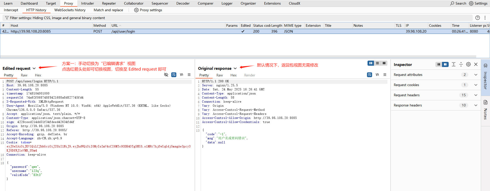
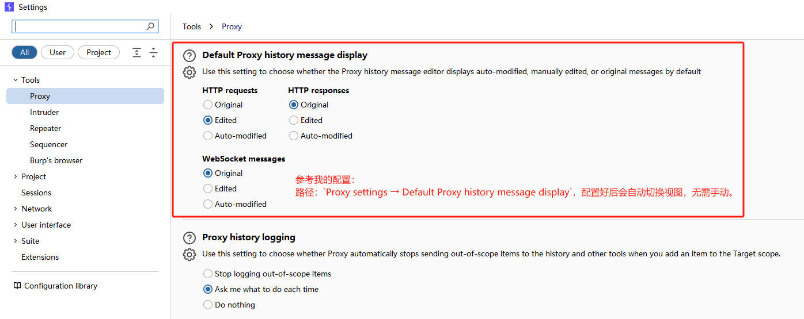
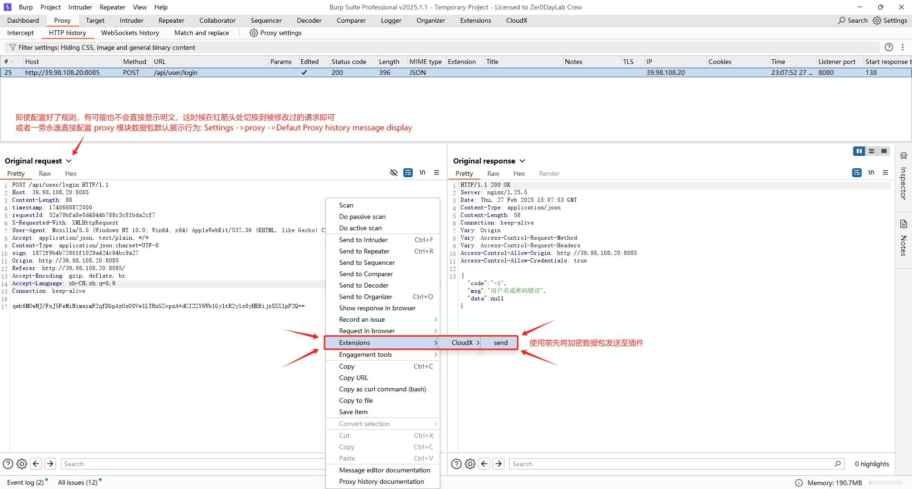
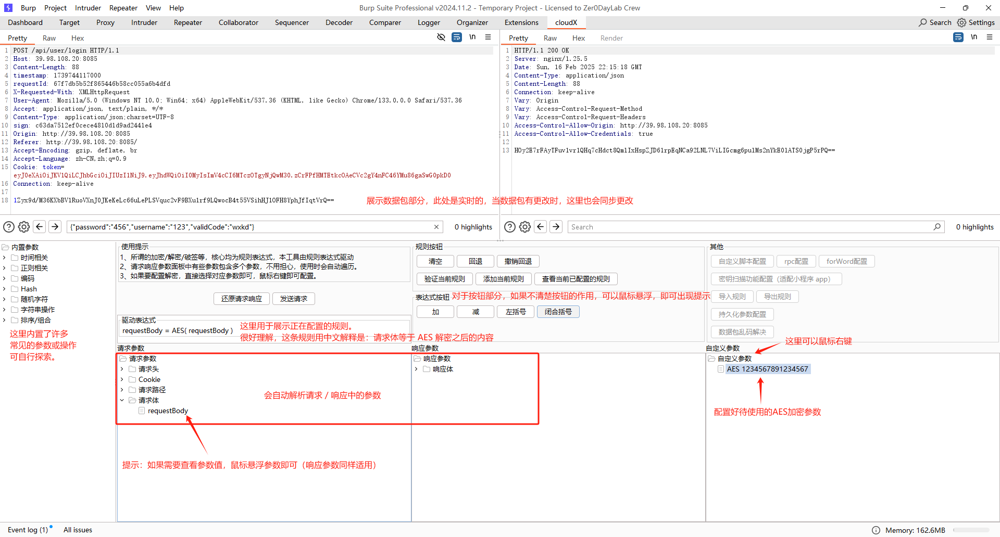

> 一直以来，我都在思考渗透测试过程中加密、防重放、签名的最优解决方案，市面上也出现了很多成熟的方案及工具，但始终无法在用户代码水平和更灵活之间找到平衡。有一段时间，我甚至认为无解，但最终，我还是找到了解决方案——这也是我认为的最终解决方案。

**工具的所有行为均由规则驱动，规则是绝对的，它几乎能做到任何事。**

**得益于先进的设计理念，该工具包含注释，配置文件，代码在内共不到3000行代码**

👉 如果你觉得这个项目有用，顺手点个 Star 鼓励一下吧！Star 越多，更新越快~

---

## 使用须知：

1. 不支持 orcale JDK or JRE 启动的 Burp
2. 采用 Montoya API 开发，不支持老版本 Burp，只会不断适配优化 Burp 最新版本的使用体验
3. 工具设计原则：所有进入 Burp 的数据包都是明文数据包，发出的数据包均为加密数据包（过程中用户无感知）
4. 理论上来说，本工具没有加密解密破签的说法，所有的一切均由规则驱动，所以配置规则才是用户需要做的事情
5. 请勿将明文数据包发往 CloudX，可能会导致某些功能异常
6. 如果规则执行不符合预期，可以在 logger 选项卡查看真实发出去的数据包

---

## 使用技巧：

你可能会注意到一个现象 —— 返回包是明文，但请求包看起来仍是密文。

不用担心，其实规则已经生效了！这是因为 **Burp 的 Proxy → HTTP history 默认展示的是“原始请求”**，也就是未被工具解密前的数据视图。

### 解决方案：

方案一：手动切换为“已编辑请求视图” (点击展开查看截图)

方案二：设置默认展示“已编辑请求视图” (推荐) (点击展开查看截图)

---

## 未来方向：

1. 完善未实现的功能（灰色按钮，例如自定义脚本配置，rpc，forWord等）
2. 自动生成规则增强（时间戳规则、自动穷举生成破签规则 / 解密规则）

---

## 待定方向：

1. 引入 AI（无法保证数据安全，大概率即使实现也默认关闭）
2. 通过请求路径排除数据包（黑名单机制，不执行规则）

---

## 如何使用：

<strong>步骤1（点击展开）</strong>

<strong>步骤2（点击展开）</strong>

---

## 视频演示：https://www.bilibili.com/video/BV13EjGz2Ers

---

🌟 看到这里，如果你觉得这个项目值得期待，不妨点个 Star！

---

交流群：

---
